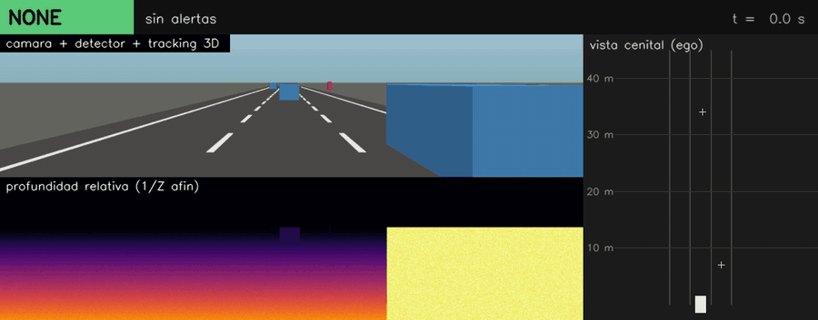
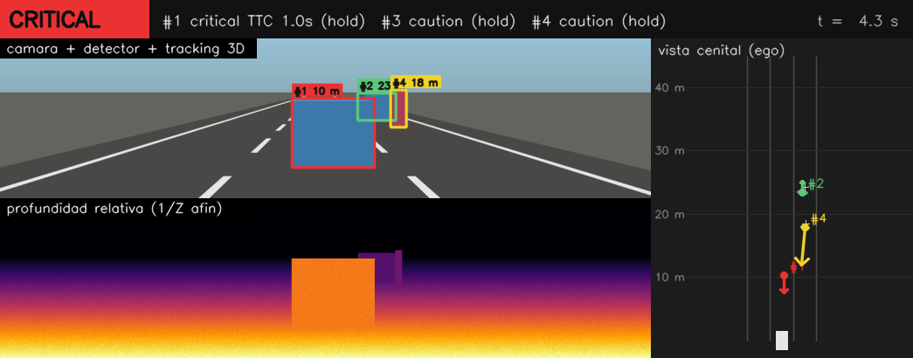
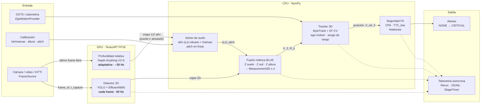
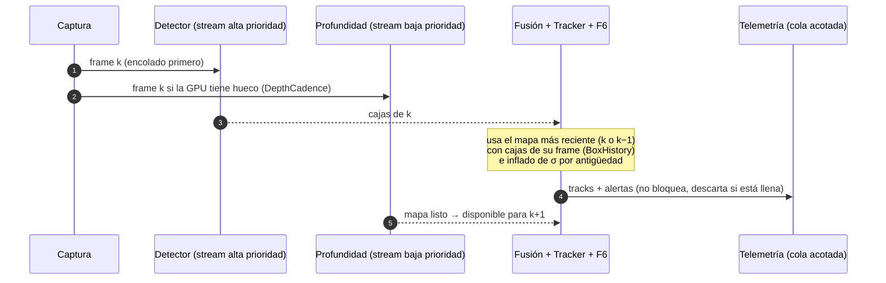
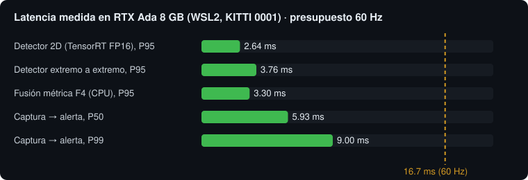

<div align="center">

# percepcion3d

**Percepción 3D monocular en tiempo real para robótica móvil y vehículos autónomos**

De una sola cámara RGB a posiciones métricas $(X, Y, Z)$, velocidad relativa, tracking 3D y
alertas de colisión TTC/CPA deterministas, con un lazo *dual-rate* medido en GPU edge.




<sub>Demo generada con <code>scripts/make_readme_assets.py</code>: escena sintética (cajas ruidosas y mapa de
1/Z afín, como el de Depth Anything) procesada por el código real de fusión F4, tracking F5 y alertas F6.
Ego a 12 m/s, coche delante acercándose, adelantamiento, coche de frente y peatón cruzando.</sub>

</div>

---

## Contenido

- [Qué hace](#qué-hace)
- [Arquitectura del pipeline](#arquitectura-del-pipeline)
- [Resultados medidos](#resultados-medidos)
- [Inicio rápido](#inicio-rápido)
- [Reproducir cada fase](#reproducir-cada-fase)
- [Estructura del repositorio](#estructura-del-repositorio)
- [Desarrollo](#desarrollo)
- [Documentación](#documentación)

## Qué hace

| Etapa | Módulo | Qué aporta |
|---|---|---|
| **Captura** | `io/sources.py` | KITTI (tracking y raw, con OXTS), vídeo, V4L2 y reproductor con jitter; `LatestFrameSlot` *latest-wins* |
| **Detector 2D** | `detection/` | YOLO → ONNX con preprocesado uint8 y `EfficientNMS_TRT` en el grafo; TensorRT FP16 con CUDA Graph y letterbox con inversa exacta |
| **Profundidad relativa** | `depth/depth_trt.py` | Depth Anything V2-S en TensorRT FP16, normalización ImageNet dentro del grafo, cadencia adaptativa |
| **Fusión métrica** | `depth/ground_solver.py`, `depth/fusion.py` | Ajuste afín robusto $(s,t)$ sobre la calzada con Kalman y gating $\chi^2$, pitch en línea, BLUE de suelo + red + altura con varianza |
| **Tracking 3D** | `tracking/` | ByteTrack 2D + Kalman CV en $[X, Z, V_X, V_Z]$ con $\Delta t$ variable, ego-motion OXTS y estado opcional de sesgo de rango |
| **Seguridad** | `safety/` | $t_{CPA}$/$d_{CPA}$ y $TTC_{low}$ con σ, compuertas de trayectoria y máquina de alertas pura con histéresis |
| **Integración** | `runtime/pipeline.py` | Lazo mono-hilo dual-rate, `frame_id` sellado, streams CUDA por prioridad, buffer de cajas para mapas atrasados |
| **Telemetría** | `telemetry/rerun_sink.py` | Cola acotada no bloqueante, Rerun perezoso, JSONL, P50/P95/P99 y VRAM por etapa |

<p align="center">
  
</p>

## Arquitectura del pipeline



<details>
<summary><b>Temporización del lazo dual-rate</b></summary>



</details>

## Resultados medidos

Todo medido en el hardware objetivo: **RTX Ada 8 GB bajo WSL2**, KITTI tracking/raw reproducido a 60 Hz.

<p align="center">
  
</p>

| Fase | Métrica | Resultado |
|---|---|---|
| F2 · Detector | `det.gpu` P50 / P95 (FP16) | 0.93 / 2.64 ms |
| | Recall moderate peatones / coches | 79.9 % / 81.2 % |
| F3 · Profundidad | Depth Anything V2-S 924×280 FP16 | ≈ 8 ms de GPU |
| F4 · Fusión métrica | AbsRel 0–30 / 30–60 m (seq. 0001) | 6.5 % / 5.7 % |
| F5 · Tracking | RMSE V tracks > 4 s / pool 0–30 m | 0.82 / ≈ 1.10 m/s |
| F6 · Alertas | Batería sintética TTC/CPA | Determinista, DoD cumplido |
| F7 · Lazo completo | Captura → alerta P50 / P99 | **5.93 / 9.00 ms** (presupuesto 16.7) |
| | Profundidad · antigüedad P95 · descartes · VRAM | 29.9 Hz · 33 ms · 0.39 % · 539 MB |
| F8 · INT8 detector | Δ recall peatones · Δ `det.gpu` P95 | −7.3 pt · −38 % → **rechazado, FP16** |

> [!NOTE]
> **Limitaciones conocidas.** El RMSE de velocidad global de F5 (≈ 1.10 m/s frente a 1.0) está limitado
> por el error de rango de F4, correlado en el tiempo; el estado de sesgo de rango del Kalman
> (`--range-bias`) está en evaluación. Todo lo medido es KITTI reproducido; falta validar con cámara real.
> Detalle y decisiones en [`docs/01_plan_fases_mvp.md`](docs/01_plan_fases_mvp.md).

## Inicio rápido

```bash
git clone https://github.com/aiambo08/perception3d.git && cd perception3d
uv venv --python 3.11 && source .venv/bin/activate
uv pip install -e ".[dev]"                                   # núcleo CPU + herramientas

pytest tests -q -m "not slow and not gpu"                    # batería CPU (sin GPU)
python scripts/eval_fusion_synthetic.py                      # DoD sintético F4
python scripts/eval_tracking_synthetic.py                    # DoD sintético F5
python scripts/eval_safety_synthetic.py --seeds 10           # DoD sintético F6
python scripts/make_readme_assets.py                         # regenera la demo de este README (ffmpeg)
```

Con GPU NVIDIA (TensorRT 10, CUDA 12):

```bash
uv pip install -e ".[runtime]"                               # tensorrt-cu12, cuda-python, rerun-sdk, nvidia-ml-py
bash scripts/run_pipeline.sh kitti-tracking ~/datasets/kitti/tracking/training 0001 --ego oxts
```

<details>
<summary><b>Arranque desde cero en WSL2 (Windows 11)</b></summary>

Pasos para dejar la máquina lista desde cero (Windows 11 + WSL2 Ubuntu 22.04
o 24.04). Los comandos se ejecutan dentro de WSL salvo que se indique
PowerShell.

1. **Driver NVIDIA en Windows** (no se instala ningún driver dentro de WSL).
   Instala el Game Ready/Studio Driver actual desde nvidia.com y comprueba
   desde WSL que la GPU se ve:
   ```bash
   nvidia-smi          # debe listar la GPU y "CUDA Version: 12.x"; si falla, actualiza el driver de Windows
   ```
   `nvidia-smi` en WSL informa memoria del proceso con menos detalle que en
   Linux nativo (WDDM); `utils/vram.py` usa NVML y devuelve `null` en los
   campos que WDDM no expone.
2. **Herramientas de sistema y `uv`:**
   ```bash
   sudo apt update && sudo apt install -y git libglib2.0-0
   curl -LsSf https://astral.sh/uv/install.sh | sh && source ~/.local/bin/env
   ```
3. **Repositorio y entorno (Python 3.11 gestionado por uv):**
   ```bash
   git clone https://github.com/aiambo08/perception3d.git ~/perception3d && cd ~/perception3d
   uv venv --python 3.11 && source .venv/bin/activate
   uv pip install -e ".[dev]"                      # CPU: tests, ruff, mypy, onnxruntime
   uv pip install -e ".[runtime]"                  # GPU: tensorrt-cu12 10.x, cuda-python, rerun-sdk, nvidia-ml-py
   uv pip install -e ".[export]"                   # sólo para exportar ONNX (torch, ultralytics, transformers)
   ```
4. **Comprobar TensorRT y cuda-python:**
   ```bash
   python -c "import tensorrt as trt, cuda; print(trt.__version__)"   # 10.x
   pytest tests -q -m "not slow and not gpu"                          # batería CPU
   ```
5. **Datos y engines:**
   ```bash
   export KT=~/datasets/kitti/tracking/training     # image_02/<seq>/, label_02/<seq>.txt, oxts/<seq>.txt
   ls "$KT/image_02/0001" | head -3
   # engines (F2/F3): ver "Detector" y "Profundidad" más abajo; comprobar:
   ls models/detector_1024x320_fp16.engine models/depth_924x280_fp16.engine
   pytest tests -q -m gpu -v                        # humo GPU: una inferencia por engine y lazo F7 de 5 s si KT está definido
   ```
   Guarda el dataset en el disco de Linux (`~/datasets`), no en `/mnt/c`: el
   acceso a NTFS desde WSL es varias veces más lento y aparece en el P99.
6. **Cámara USB en vivo (opcional, `V4L2Source`).** WSL2 no ve USB por
   defecto; se comparte con `usbipd-win`. En PowerShell como administrador:
   ```powershell
   winget install usbipd
   usbipd list                                     # anota el BUSID de la cámara
   usbipd bind --busid <BUSID>
   usbipd attach --wsl --busid <BUSID>             # repetir tras cada reconexión
   ```
   En WSL: `ls /dev/video*` debe mostrar la cámara. El kernel de WSL por
   defecto no trae `uvcvideo`; si no aparece `/dev/video0`, hace falta un
   kernel WSL compilado con UVC (fuera del alcance de este repo). Sin cámara
   todo el pipeline se prueba con KITTI o vídeo.
7. **Visor Rerun.** Bajo WSLg el visor se renderiza con `llvmpipe` (CPU) y
   compite con el lazo (medido: P99 18.8 frente a 12.8 ms). Para medir,
   `TELEMETRY=none` o `RERUN_SAVE=reports/x.rrd`; para ver, abre el visor
   nativo en Windows (`pip install rerun-sdk` y `rerun` en PowerShell) y usa
   `RERUN_CONNECT=<ip-de-windows>:9876` desde WSL.

</details>

## Reproducir cada fase

<details>
<summary><b>Comandos por fase (F1–F8)</b></summary>

```bash
uv run python scripts/profile_stage.py --stage rectify           # P50/P95/P99 de una etapa
uv run python scripts/profile_stage.py --stage playback --hz 60  # replay + jitter
uv run python scripts/profile_stage.py --stage playback --kitti <drive_sync> --hz 60
```

Detector (F2), en la máquina con GPU:

```bash
uv pip install -e ".[export]"
uv run python scripts/export_detector.py --config configs/models.yaml   # YOLO → ONNX (uint8 + NMS)
uv pip install -e ".[runtime]"
bash scripts/export_trt.sh models/detector_1024x320.onnx models/detector_1024x320_fp16.engine fp16
uv run python scripts/bench_detector.py --kitti-root <tracking/training> --seqs 0000 0001 0020 \
    --frames 200 --json reports/f2_detector.json                        # P50/P95/P99 + VRAM + recall (CI95)
```

Profundidad (F3), en la máquina con GPU:

```bash
uv run python scripts/export_depth.py --config configs/models.yaml       # HF → ONNX (uint8 + ImageNet) ×3 tamaños
for s in 924x280 840x252 1064x322; do
  bash scripts/export_trt.sh models/depth_$s.onnx models/depth_${s}_fp16.engine fp16
done
uv run python scripts/bench_depth.py --mode depth --frames 300           # P50/P95/P99 + VRAM por tamaño
uv run python scripts/bench_depth.py --mode matrix --size 924x280 --pace-hz 60 \
    --kitti-drive <2011_09_26_drive_0005_sync> --frames 150 \
    --json reports/f3_matrix.json                                        # det / depth / ambos + Spearman LiDAR
```

Fusión métrica (F4):

```bash
uv run python scripts/eval_fusion_synthetic.py --json out/f4_synth.json   # DoD sintéticos + P95 CPU (sin GPU)
uv run python scripts/eval_fusion_kitti.py --root <kitti_tracking/training> --seq 0000 \
    --engine models/depth_924x280_fp16.engine --json out/f4_kitti.json    # AbsRel 0–30 / 30–60 m (GPU)
```

Tracking 3D (F5):

```bash
uv run python scripts/eval_tracking_synthetic.py --json out/f5_synth.json  # RMSE V, Δt jitter, estáticos, P95 CPU
uv run python scripts/eval_tracking_kitti.py --root <kitti_tracking/training> \
    --seqs 0000 0001 0020 --ego oxts --json out/f5_kitti.json               # necesita training/oxts/
```

El filtro de pitch en línea de F4 es robusto por defecto (`pitch_filter:` en
`configs/fusion.yaml`: `robust_r`, `soft_gate`, `reset_after_gated`) y el pitch
nominal de KITTI es 0°. `eval_fusion_kitti.py` y `eval_tracking_kitti.py` aceptan
`--pitch-filter legacy --nominal-pitch-deg 2.5` para reproducir el filtro anterior;
el JSON de F4 cuenta en `pitch.n_discarded` / `pitch.n_frames_gated` las medidas
descartadas y los frames fuera del gate.

Para el sesgo de velocidad en curvas, `eval_tracking_kitti.py` imprime y guarda en
`diagnostics.turn` (y en `pooled_diagnostics` con todas las secuencias) el ajuste del
error frente a `ω·X` y el error por sentido de giro con la deriva del rango
`d(ez)/dt`. `--oxts-offset-ms` y `--lever-arm` permiten barrer el desfase OXTS↔cámara
y el brazo de palanca (comandos en `docs/01_plan_fases_mvp.md`, F5).
`diagnostics.consistency` mide, por edad del track, el NIS medio y el cociente entre el
error real de V_Z y la σ que predice el filtro; `--r-scale` (escala de `R` de F4) y
`--q-vehicle` permiten barrer la sintonía.

Seguridad (F6):

```bash
uv run python scripts/eval_safety_synthetic.py --seeds 10 --json out/f6_synth.json  # batería de alertas + determinismo
```

Lazo integrado y telemetría (F7):

```bash
# Arnés CPU (cajas GT, sin red): latencias, cadencia y telemetría JSONL, sin GPU
uv run python scripts/run_pipeline.py --kitti-tracking <kitti_tracking/training> --seq 0001 \
    --boxes gt --hz 60 --loop --duration 20 --telemetry jsonl --json out/f7_cpu.json
# DoD en la GPU objetivo: engines F2/F3, 5 min en bucle, visor Rerun (uv pip install -e ".[runtime]")
bash scripts/run_pipeline.sh kitti-tracking <kitti_tracking/training> 0001 --ego oxts
# Variante con hilo de captura (LatestFrameSlot) si el P99 falla por CPU; sin visor
CAPTURE_THREAD=1 TELEMETRY=none bash scripts/run_pipeline.sh kitti-tracking <kitti_tracking/training> 0001
# Vídeo cualquiera (intrínsecas de --camera) o KITTI raw
bash scripts/run_pipeline.sh video <clip.mp4> --camera configs/camera_kitti.yaml
bash scripts/run_pipeline.sh kitti-raw <2011_09_26_drive_0005_sync>
```

El informe JSON (`reports/f7_<modo>.json`) trae `stats` (P50/P95/P99 de
captura→alerta, Hz de profundidad, antigüedad y retraso del mapa, descartes,
coste de `log()`), `stages` (`StageTimer`), `telemetry` (encolados / emitidos /
descartados / errores) y `verdicts` por criterio del DoD (`null` = no medible
en esa configuración, p. ej. VRAM sin GPU).

Endurecimiento (F8), en la máquina con GPU:

```bash
# 1. INT8 del detector con calibración de entropía sobre ~500 frames KITTI (guarda el caché)
uv run python scripts/export_trt.py models/detector_1024x320.onnx models/detector_1024x320_int8.engine \
    --precision int8 --calib-dir "$KT/image_02/0000" "$KT/image_02/0001" "$KT/image_02/0020" \
    --calib-frames 500 --calib-cache models/detector_1024x320_int8.cache
# 2. Mismo benchmark con los dos engines y veredicto. Secuencias con muchos peatones
#    (≈ 6700 moderate): con 0000/0001/0020 sólo hay 67 y el IC95 no decide
for P in fp16 int8; do
  uv run python scripts/bench_detector.py --engine models/detector_1024x320_$P.engine \
    --kitti-root "$KT" --seqs 0001 0013 0015 0016 0017 0019 --frames 500 --warmup 200 \
    --json reports/det_${P}_ped.json --archive
done
uv run python scripts/compare_engines.py reports/det_fp16_ped.json reports/det_int8_ped.json \
    --json reports/det_fp16_vs_int8_ped.json # ACCEPT si Δrecall peatones ≥ −2 pt y det.gpu P95 baja ≥ 25 %
# 3. Histórico: --archive en bench_detector/bench_depth/run_pipeline guarda una copia en data/outputs/bench/
uv run python scripts/bench_history.py list
uv run python scripts/bench_history.py check --name pipeline   # regresión si P95/P99/VRAM/descartes empeoran > 10 % y > 0.2
# 4. Tests de humo en GPU (se saltan sin tensorrt/cuda-python o sin engines)
KT="$KT" uv run pytest tests -q -m gpu -v
# 5. Regenerar engines en una imagen nvidia/cuda pinada (requiere NVIDIA Container Toolkit)
docker build -f docker/Dockerfile.trt -t percepcion3d-trt .
docker run --rm --gpus all -v "$PWD/models:/workspace/models" percepcion3d-trt \
    models/detector_1024x320.onnx models/detector_1024x320_fp16.engine --precision fp16
```

`compare_engines.py` devuelve 0 con `ACCEPT` y 1 con `REJECT`; el JSON trae
Δrecall por clase con su IC95 (`recall_conclusive=false` avisa de que el
intervalo cruza el umbral y conviene más frames) y Δlatencia por etapa.
`bench_history.py check` devuelve 1 si hay regresiones y 2 si falta la
entrada; los ficheros `data/outputs/bench/<AAAAMMDD_HHMMSS>_<nombre>.json`
se versionan a propósito (son pequeños) para que el histórico viaje con el
repo.

</details>

## Estructura del repositorio

```text
perception3d/
├── configs/            # cámara, modelos, fusión, tracking (sintético / KITTI) y seguridad (YAML)
├── docker/             # Dockerfile.trt: imagen nvidia/cuda pinada para regenerar engines
├── docs/               # análisis crítico, plan por fases con DoD y assets del README
├── scripts/            # export ONNX/TRT, benchmarks, evaluaciones KITTI/sintéticas, runner del lazo
├── src/percepcion3d/
│   ├── camera/         # intrínsecas, extrínsecas, geometría pinhole, rectificación
│   ├── io/             # fuentes KITTI, vídeo, V4L2
│   ├── detection/      # letterbox, cirugía ONNX, detector TensorRT, calibración INT8
│   ├── depth/          # profundidad TensorRT, solver de suelo, muestreo y fusión métrica
│   ├── tracking/       # ByteTrack, Kalman CV (+ sesgo de rango), ego-motion, Tracker3D
│   ├── safety/         # cinemática CPA/TTC, compuertas y máquina de alertas
│   ├── runtime/        # CUDA, TrtEngine, buffers, lazo dual-rate
│   ├── telemetry/      # sinks asíncronos y Rerun
│   ├── sim/            # escenas sintéticas deterministas
│   ├── eval/           # métricas KITTI y sintéticas por fase
│   └── utils/          # profiling P50/P95/P99, VRAM (NVML), histórico de benchmarks
└── tests/              # pytest (markers slow y gpu)
```

## Desarrollo

```bash
uv venv --python 3.11 && uv pip install -e ".[dev]"      # núcleo CPU + herramientas
ruff check src scripts tests && ruff format --check src scripts tests
mypy src tests
pytest tests -m "not slow and not gpu"
pytest tests -m gpu                                       # sólo con GPU + engines; se salta si faltan
```

Grupos opcionales (`pyproject.toml`):

| Extra | Contenido | Cuándo |
|---|---|---|
| *(núcleo)* | numpy, opencv-headless, pyyaml, scipy | siempre; CI |
| `runtime` | tensorrt-cu12 10.x, cuda-python, rerun-sdk, nvidia-ml-py | inferencia y VRAM en la GPU objetivo |
| `export` | torch, torchvision, ultralytics, transformers, onnx | exportar ONNX (detector y depth) |
| `dev` | pytest, ruff, mypy, onnx, onnxruntime | desarrollo y CI (tests de cirugía ONNX en CPU) |

## Documentación

| Documento | Contenido |
|---|---|
| [`docs/00_analisis_critico.md`](docs/00_analisis_critico.md) | Riesgos, trade-offs (latencia vs. precisión, memoria vs. robustez) y mitigaciones por etapa |
| [`docs/01_plan_fases_mvp.md`](docs/01_plan_fases_mvp.md) | Fases F0–F8, Definition of Done, estrategia de medición y resultados con sus decisiones |
