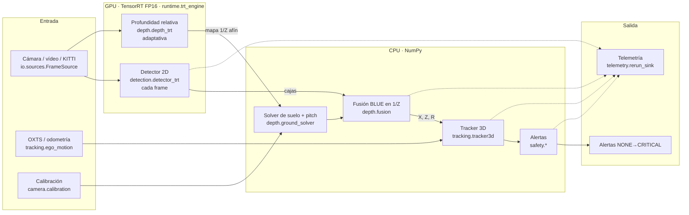
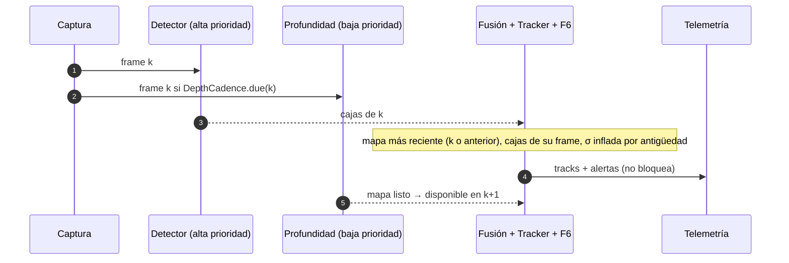

# percepcion3d — Documento técnico: teoría, diseño y código

> Documento de referencia del proyecto completo (fases F0–F8). Explica **qué** hace cada
> etapa, **por qué** se diseñó así, la **teoría** en la que se apoya (con fórmulas y
> referencias) y **dónde** está implementada en el código. Complementa a
> [`00_analisis_critico.md`](00_analisis_critico.md) (riesgos y alternativas evaluadas antes de
> programar) y a [`01_plan_fases_mvp.md`](01_plan_fases_mvp.md) (plan, DoD por fase y bitácora de
> medidas). El [`README.md`](../README.md) es la puerta de entrada rápida.

---

## Índice

1. [Cómo leer este documento](#1-cómo-leer-este-documento)
2. [El problema y la arquitectura](#2-el-problema-y-la-arquitectura)
3. [Convenciones: marcos, unidades y notación](#3-convenciones-marcos-unidades-y-notación)
4. [F0 · Análisis crítico y plan](#4-f0--análisis-crítico-y-plan)
5. [F0.1 · Geometría de cámara y plano del suelo](#5-f01--geometría-de-cámara-y-plano-del-suelo)
6. [F1 · Medición, entrada/salida y simulación](#6-f1--medición-entradasalida-y-simulación)
7. [F2 · Detector 2D en TensorRT](#7-f2--detector-2d-en-tensorrt)
8. [F3 · Profundidad relativa](#8-f3--profundidad-relativa)
9. [F4 · Fusión métrica](#9-f4--fusión-métrica)
10. [F5 · Tracking 3D y compensación de ego-motion](#10-f5--tracking-3d-y-compensación-de-ego-motion)
11. [F6 · Cinemática relativa y alertas](#11-f6--cinemática-relativa-y-alertas)
12. [F7 · Lazo dual-rate y telemetría](#12-f7--lazo-dual-rate-y-telemetría)
13. [F8 · Endurecimiento: INT8, histórico y reproducibilidad](#13-f8--endurecimiento-int8-histórico-y-reproducibilidad)
14. [Validación: tests, DoD y evaluación](#14-validación-tests-dod-y-evaluación)
15. [Historia de decisiones (PR a PR)](#15-historia-de-decisiones-pr-a-pr)
16. [Limitaciones conocidas y líneas futuras](#16-limitaciones-conocidas-y-líneas-futuras)
17. [Referencias](#17-referencias)

---

## 1. Cómo leer este documento

Cada fase sigue el mismo esquema:

| Bloque | Contenido |
|---|---|
| **Objetivo** | Qué entrega la fase y qué criterio de aceptación (DoD) tenía |
| **Teoría** | Modelos matemáticos, derivaciones y teoremas en los que se apoya |
| **Diseño** | Decisiones de ingeniería y alternativas descartadas |
| **Código** | Módulos, clases y funciones que implementan cada ecuación |
| **Medido** | Resultados en la GPU objetivo (RTX Ada 8 GB bajo WSL2, KITTI reproducido) |

Las rutas de código son relativas a `src/percepcion3d/` salvo que se indique lo contrario
(`scripts/`, `configs/`, `tests/`). Las fórmulas usan la notación de la sección 3. Las
referencias bibliográficas están numeradas `[n]` y listadas al final.

Todas las cifras "medidas" proceden de las corridas del usuario en su GPU, recogidas en los
JSON de `reports/` y anotadas en `01_plan_fases_mvp.md`; nada de este documento se midió en
CI ni en la máquina de desarrollo (que no tiene GPU).

---

## 2. El problema y la arquitectura

### 2.1 Problema

A partir de **una sola cámara RGB** montada en un vehículo o robot, estimar en tiempo real, por
cada objeto relevante (coches, peatones, ciclistas…):

- la posición métrica en el suelo $(X, Z)$ respecto a la cámara y su incertidumbre;
- la velocidad relativa $\mathbf{v}_{rel}$ y, si se conoce el movimiento propio, la velocidad
  sobre el suelo;
- una identidad persistente (track);
- una alerta de colisión determinista (tiempo hasta colisión, punto de máxima aproximación).

Y hacerlo con un presupuesto de **16.7 ms por frame** (60 Hz) en una GPU de portátil de 8 GB.

La dificultad central de la visión monocular es que una imagen no contiene la escala: un coche
grande lejos y uno pequeño cerca producen la misma proyección. Toda la profundidad métrica tiene
que venir de **conocimiento previo**: la altura de la cámara sobre el suelo, la hipótesis de
suelo plano, la altura típica de las clases de objetos, o un modelo de profundidad entrenado.
El proyecto combina las tres primeras con un modelo de profundidad **relativa** (que da forma,
no escala) y las fusiona con sus incertidumbres.

### 2.2 Arquitectura



El orquestador es `runtime.pipeline.Pipeline` (F7). Cada fase del plan añadió una capa:

| Fase | Paquete | Entrega |
|---|---|---|
| F0 | `docs/` | Análisis de riesgos, plan por fases con DoD medibles |
| F0.1 | `camera/` | Geometría pinhole + suelo con varianza propagada |
| F1 | `utils/`, `io/`, `runtime/buffer.py`, `sim/`, `eval/kitti.py` | Percentiles, fuentes, buffer *latest-wins*, escena sintética, GT KITTI |
| F2 | `detection/`, `runtime/trt_engine.py` | Detector YOLO en TensorRT con NMS en el grafo |
| F3 | `depth/depth_trt.py`, `depth/preprocess.py`, `eval/lidar.py` | Depth Anything V2-S en TensorRT, validación frente a LiDAR |
| F4 | `depth/ground_solver.py`, `depth/sampling.py`, `depth/fusion.py` | Escala métrica y fusión de tres pistas |
| F5 | `tracking/` | ByteTrack + Kalman CV con ego-motion |
| F6 | `safety/` | CPA, TTC y máquina de alertas |
| F7 | `runtime/pipeline.py`, `runtime/cuda.py`, `telemetry/` | Lazo dual-rate, telemetría asíncrona |
| F8 | `detection/int8_calibration.py`, `eval/engine_compare.py`, `utils/bench_history.py`, `docker/` | INT8, veredicto A/B, histórico, Docker |

---

## 3. Convenciones: marcos, unidades y notación

**Marco de cámara C** (óptico, OpenCV): $X_c$ derecha, $Y_c$ abajo, $Z_c$ hacia delante por el eje
óptico. La **profundidad** $Z$ es siempre la coordenada $Z_c$ (profundidad óptica), no la
longitud del rayo. Es la convención de KITTI (`location.z`) y del modelo pinhole.

**Marco de suelo G**: mismo origen (centro óptico), $X_g$ derecha, $Y_g$ abajo, $Z_g$ hacia
delante **paralelo al suelo**. El suelo es el plano $Y_g = h$, con $h$ la altura de la cámara.
Se obtiene de C girando el *pitch* $\theta$ (positivo mirando hacia abajo) y el *roll* $\rho$:

$$
R_{cg} = R_x(\theta)\,R_z(\rho), \qquad \mathbf{p}_g = R_{cg}\,\mathbf{p}_c
$$

(`camera.geometry.camera_to_ground_rotation`, `PinholeGeometry.camera_to_ground`).

**Intrínsecas** $K$: $f_x, f_y, c_x, c_y$ en píxeles (`camera.calibration.CameraIntrinsics`).
Coordenadas normalizadas: $x = (u - c_x)/f_x$, $y = (v - c_y)/f_y$.

**Profundidad inversa** $\rho = 1/Z$ (m⁻¹). Toda la fusión de F4 trabaja en $\rho$.

**Tiempo**: `t_capture_ns` es el reloj de la escena (timestamps del dataset o de la captura) y
gobierna Kalman y TTC; `t_ingress_ns` es el reloj monotónico local y mide latencias.
Los intervalos $\Delta t$ son variables (no se asume frecuencia fija).

**Incertidumbre**: $\sigma$ es desviación típica 1-σ; $P$, $R$, $Q$ y $\Sigma$ son covarianzas.
Las cotas "conservadoras" usan $k\sigma$ con $k = 1.5$ por defecto.

**Percentiles**: P50, P95, P99 de latencias, medidos con `perf_counter_ns` (CPU) o eventos
CUDA (GPU).

---

## 4. F0 · Análisis crítico y plan

**Objetivo.** Antes de escribir código, identificar los riesgos que podían invalidar el
enfoque y fijar criterios de aceptación medibles por fase.

**Contenido** ([`00_analisis_critico.md`](00_analisis_critico.md)): para cada etapa del pipeline
propuesto se analizaron riesgos (R1–R9), trade-offs y mitigaciones. Los que más marcaron el
diseño:

| Riesgo | Enunciado | Mitigación que acabó en el código |
|---|---|---|
| R1 | La profundidad monocular relativa no tiene escala; recuperarla desde los objetos es circular | Escala desde la **calzada** (miles de píxeles con profundidad geométrica conocida) y no desde los objetos que se van a medir (§9.2) |
| R2 | El pitch del montaje cambia (frenadas, carga) y su error crece con $Z^2$ | Pitch **en línea** desde alturas de clase (§9.4) y varianza propagada (§5.3) |
| R3 | Dos redes compitiendo por la GPU rompen el presupuesto del detector | Streams con **prioridad** y profundidad **adaptativa** (§7.4, §12.2) |
| R4 | Errores no gaussianos en el mapa de profundidad (bordes, cielo, oclusiones) | Estadísticos robustos (mediana/MAD, Otsu) y gates $\chi^2$ (§9.3, §9.5) |
| R5 | Velocidad por diferencias finitas de $Z$ ruidosa: amplifica el error | Kalman con modelo de aceleración blanca continua, $\Delta t$ variable (§10.3) |
| R6 | Mapa de profundidad atrasado respecto a las cajas | Cajas del frame del mapa (`BoxHistory`) + inflado de $\sigma$ por antigüedad + retrodicción en el KF (§12.3) |
| R7 | Alertas con parpadeo (*flicker*) | Histéresis en valor y en tiempo, máquina determinista (§11.3) |
| R8 | El movimiento propio se confunde con el del objeto | Estado con velocidad **sobre el suelo** y ego-motion en la predicción (§10.4) |
| R9 | La telemetría bloquea el lazo | Cola acotada con descarte y hilo aparte (§12.4) |

**Plan** ([`01_plan_fases_mvp.md`](01_plan_fases_mvp.md)): fases F0.1–F8 con un *Definition of
Done* numérico cada una (P95/P99, AbsRel por bins, RMSE de velocidad, VRAM…). La bitácora
final de cada fase recoge lo medido y las desviaciones.

---

## 5. F0.1 · Geometría de cámara y plano del suelo

**Objetivo.** Un módulo de geometría exacto y testado: proyección, deproyección,
intersección con el suelo y **propagación de varianza**. Todo lo métrico del proyecto descansa
en él. PR: [#2](https://github.com/aiambo08/perception3d/pull/2).

### 5.1 Modelo pinhole

Un punto $\mathbf{p}_c = (X_c, Y_c, Z_c)$ se proyecta en

$$
u = f_x \frac{X_c}{Z_c} + c_x,\qquad v = f_y \frac{Y_c}{Z_c} + c_y
$$

y, conocida la profundidad óptica $Z_c$, se recupera $\mathbf{p}_c = Z_c\,(x, y, 1)$
[1, cap. 6]. Código: `PinholeGeometry.project_point`, `deproject_pixel_with_depth`,
`deproject_pixel_to_ray`. El test de **reversibilidad geométrica** (`tests/test_geometry.py`)
exige que proyectar y deproyectar sea la identidad hasta $10^{-9}$.

### 5.2 Rectificación de la distorsión

Las lentes reales no son pinhole. El modelo de Brown–Conrady [2] corrige la distorsión radial
$(k_1, k_2, k_3)$ y tangencial $(p_1, p_2)$:

$$
x_d = x(1 + k_1 r^2 + k_2 r^4 + k_3 r^6) + 2p_1 xy + p_2(r^2 + 2x^2),\quad r^2 = x^2 + y^2
$$

`camera.undistort.ImageRectifier` precalcula los mapas de remuestreo (`cv2.initUndistortRectifyMap`)
una sola vez y aplica `cv2.remap` por frame; después de rectificar, las intrínsecas efectivas
son las de la cámara virtual sin distorsión. KITTI ya viene rectificado, por lo que en las
evaluaciones esta etapa es identidad.

### 5.3 Intersección con el suelo

Para el rayo del píxel $(u, v)$, en el marco G, la componente vertical del rayo unitario es
$d_y = (R_{cg}\,\mathbf{r}_c)_y$. Con el plano $Y_g = h$, el punto de contacto está en
$\mathbf{p}_g = (h/d_y)\,R_{cg}\mathbf{r}_c$. Para roll cero y $\alpha = \arctan y$ (ángulo del
rayo bajo el eje óptico), se obtienen las formas cerradas:

$$
Z_c = \frac{h\cos\alpha}{\sin(\theta + \alpha)},\qquad
d_{long} = \frac{h}{\tan(\theta + \alpha)},\qquad
\ell = \frac{h}{\sin(\theta + \alpha)}
$$

donde $Z_c$ es la profundidad óptica, $d_{long}$ la distancia planar hacia delante y $\ell$ la
longitud euclídea del rayo (`PinholeGeometry.compute_ground_distances`, `ground_hits`).

> **Corrección de F0.1.** El código heredado devolvía $\ell$ como profundidad. Como
> $\ell > Z_c$ siempre, todas las distancias quedaban sesgadas hacia arriba y el error crecía con
> $\alpha$. El PR [#2](https://github.com/aiambo08/perception3d/pull/2) fijó $Z_c = h\cos\alpha/\sin(\theta+\alpha)$
> y añadió un test de valor cerrado con las intrínsecas de KITTI.

El **horizonte** es la fila donde el rayo es paralelo al suelo ($d_y = 0$):
$v_h = c_y - f_y\tan\theta$ sin roll; con roll es una recta $\mathbf{n}\cdot\mathbf{r}_c = 0$
(`get_horizon_v(u)`). Los píxeles en o sobre el horizonte no cortan el suelo y se marcan
`valid = False` en la API vectorizada, en lugar de lanzar excepción.

**Forma afín de la profundidad inversa del suelo.** Con roll cero,

$$
\rho_g(v) = \frac{1}{Z_c} = \frac{\sin\theta + y\cos\theta}{h},\qquad y = \frac{v - c_y}{f_y}
$$

es **exactamente lineal en la fila**. Esta identidad es la clave del solver de F4 (§9.2) y de
su límite de observabilidad.

### 5.4 Propagación de varianza (método delta)

Las dos fuentes de error dominantes son el pitch (montaje, frenadas) y la fila de contacto
(*jitter* del detector). Con $\sigma_\theta$ y $\sigma_v$ independientes, a primer orden [3]:

$$
\sigma_Z^2 \approx \left(\frac{\partial Z}{\partial\theta}\right)^2\sigma_\theta^2
 + \left(\frac{\partial Z}{\partial v}\right)^2\sigma_v^2
$$

`ground_hits` calcula las derivadas por diferencias centradas sobre la geometría exacta
(pasos $10^{-6}$ rad y $10^{-3}$ px), lo que las mantiene consistentes con roll. Lejos de la
cámara, $\partial d/\partial\theta \approx d^2/h$, de modo que $\sigma_d \approx (d^2/h)\,\sigma_\theta$:
**el error del pitch crece con el cuadrado de la distancia**, la razón por la que el pitch se
estima en línea en F4. `GroundNoiseModel` recoge $\sigma_\theta$ (0.5° por defecto) y $\sigma_v$
(1 px). Los tests comprueban la varianza frente a Monte Carlo.

---

## 6. F1 · Medición, entrada/salida y simulación

**Objetivo.** Las herramientas para medir con rigor antes de optimizar, las fuentes de frames y
un generador sintético con verdad terreno. PR: [#3](https://github.com/aiambo08/perception3d/pull/3).

### 6.1 Percentiles de latencia

Las medias esconden las colas; en tiempo real lo que importa es el peor caso frecuente. El plan
fija DoD en **P50/P95/P99**. `utils.profiling.StageTimer` usa *ring buffers* de capacidad fija
(sin asignación en el camino caliente) y `perf_counter_ns`; los tiempos de GPU medidos con
eventos CUDA se inyectan con `record`. Exporta tabla, JSON y CSV. `utils.vram` muestrea la
memoria de GPU vía NVML (bajo WDDM/WSL2 algunos campos no están disponibles y se devuelven
`null`).

### 6.2 Buffer *latest-wins*

Con captura a 60 Hz y consumidor más lento, una cola FIFO acumula latencia sin límite.
`runtime.buffer.LatestFrameSlot` guarda **un** frame: `put` sobrescribe el no consumido (y lo
cuenta como descartado) y `get` bloquea hasta que hay uno más nuevo. La memoria está acotada a
un frame y la latencia a un periodo de captura.

### 6.3 Fuentes

`io.sources.FrameSource` es el protocolo común; `VideoFileSource`, `KittiSequenceSource`
(con OXTS y timestamps del dataset) y `V4L2Source` (cámara en vivo) lo implementan.
`runtime.playback` reproduce una fuente a un ritmo objetivo con *jitter* configurable para
ensayar el lazo con $\Delta t$ variable.

### 6.4 Escena sintética

`sim.synthetic.SyntheticScene` genera objetos 3D a velocidad constante y produce exactamente lo
que consume el pipeline: cajas 2D con ruido, filas de contacto, y un mapa de profundidad inversa
**afín** ($\hat d = s/Z + t$ más ruido multiplicativo), como haría un modelo de profundidad
relativa. Permite testar F4–F6 en CI sin GPU y es lo que genera la demo del README
(`scripts/make_readme_assets.py`).

### 6.5 Verdad terreno KITTI

`eval.kitti` carga `label_02/XXXX.txt` (tracking): la `z` de la caja 3D es la profundidad
óptica del objeto y `track_id` da GT de tracking sin proyectar LiDAR. Métricas por bins de
distancia: **AbsRel** $= \frac{1}{N}\sum |Z - Z_{gt}|/Z_{gt}$ y RMSE.

---

## 7. F2 · Detector 2D en TensorRT

**Objetivo.** Cajas 2D con clase cada frame en $\le 6$ ms P95 y $\le 900$ MB de VRAM, con recall
verificado tras la exportación. PR: [#4](https://github.com/aiambo08/perception3d/pull/4).

### 7.1 Modelo

YOLO11n (Ultralytics) [4], entrada **1024×320**: KITTI es 1242×375 (≈3.3:1); un cuadrado
640×640 desperdiciaría ~70 % del tensor en relleno, mientras que 1024×320 deja ~4 %. El coste
de una red convolucional escala con los píxeles de entrada, así que la forma rectangular
compra resolución horizontal (peatones lejanos) al mismo coste.

### 7.2 Letterbox exacto

`detection.letterbox.Letterboxer` escala por un único factor $s$ y pega en un lienzo `uint8`
preasignado con desplazamiento entero $(p_x, p_y)$:

$$
u_{net} = s\,u + p_x,\qquad u = (u_{net} - p_x)/s
$$

Al guardar $s$ como cociente real de tamaños (no redondeado), la inversa es exacta hasta
$10^{-9}$ px (test de ida y vuelta). Eso evita que el error de redondeo del letterbox se
convierta en error de fila de contacto, que F4 amplifica.

### 7.3 Cirugía del grafo ONNX

`detection.onnx_surgery` edita el protobuf ONNX sin TensorRT:

1. `prepend_uint8_preprocess`: la entrada pasa a `uint8 [1,H,W,3]` BGR (lo que da OpenCV) y
   el grafo incorpora `Cast → Transpose → BGR→RGB → /255` (y opcionalmente
   $(x-\mu)/\sigma$ por canal, plegado en un `Mul` + `Add`). El host sube **1 byte/píxel** sin
   `astype` ni `transpose`.
2. `append_efficient_nms`: sustituye la salida cruda `[1, 4+C, N]` por el plugin
   `EfficientNMS_TRT`, que devuelve `num_dets`, `det_boxes`, `det_scores`, `det_classes`. El
   NMS en GPU elimina la copia de miles de candidatos al host.

### 7.4 Motor TensorRT y asincronía

`runtime.trt_engine.TrtEngine` (detrás del protocolo `EngineBackend`, sustituible por un
*fake* en tests) posee buffers de dispositivo y *pinned* preasignados, un stream (con prioridad
alta para el detector), eventos de inicio/fin para medir tiempo de GPU y, opcionalmente, un
**CUDA Graph** de `execute_async_v3` que reduce el coste de lanzamiento. `infer_async`
devuelve un *handle*; `wait()` sincroniza con **un evento**, nunca con
`cudaDeviceSynchronize`, para que detector y profundidad se solapen en la GPU (R3).
`runtime.cuda.CudaRuntime` envuelve `cuda-python` con `cudart` inyectable.

### 7.5 Validación de la exportación

`eval.detection` mide **recall** por tipo KITTI (emparejamiento voraz por IoU, mapa COCO→KITTI)
sobre objetos *moderate*. Es una comprobación de que el motor sigue encontrando los objetos, no
una métrica de calidad del modelo. El intervalo de confianza usa **Wilson** [5], que se comporta
bien con pocas muestras (las secuencias 0000/0001/0020 solo tienen 67 peatones; para decidir
hubo que añadir 0013/0015/0016/0017/0019, ≈6700 peatones — PR [#7](https://github.com/aiambo08/perception3d/pull/7)).

**Medido (FP16):** `det.gpu` P50/P95 = 0.93/2.64 ms; recall moderate peatones 79.9 %, coches
81.2 %; VRAM dentro del presupuesto.

---

## 8. F3 · Profundidad relativa

**Objetivo.** Un mapa denso de profundidad inversa relativa a ≈30 Hz que conviva con el
detector. PR: [#5](https://github.com/aiambo08/perception3d/pull/5).

### 8.1 Modelo y ambigüedad afín

Depth Anything V2-Small [6] (ViT-S, 25 M parámetros) se entrena con la pérdida
**invariante a escala y desplazamiento** de MiDaS [7], por lo que su salida es una disparidad
afín-invariante:

$$
\hat d(u, v) = s\cdot\frac{1}{Z(u,v)} + t,\qquad (s, t)\ \text{desconocidos y distintos en cada frame}.
$$

La variante métrica existe pero generaliza peor entre cámaras; se eligió la relativa y se
recupera $(s, t)$ en F4 a partir de la geometría. El *default* es `variant: relative` en
`configs/models.yaml`; la métrica queda como opción.

### 8.2 Tamaño de entrada y preprocesado

Un ViT tiene coste $\mathcal{O}(N^2)$ en el número de tokens $N$ (parches de 14×14). Se exporta a
**924×280** (1320 tokens, equivalente al 518×518 de entrenamiento) con alternativas 840×252 y
1064×322 medidas en `scripts/bench_depth.py`. A diferencia del detector, la imagen se
**estira** sin bordes (`depth.preprocess`): los bordes grises entrarían en la atención global y
desplazarían la disparidad de todos los píxeles, y los tokens de relleno son cómputo perdido.
La anisotropía residual (1242×375 → 924×280) es ≲1 %. `DepthResize` guarda el mapa
frame↔red para muestrear cajas sin redimensionar el mapa.

### 8.3 Validación frente a LiDAR

Como $(s, t)$ son desconocidos, una métrica absoluta no tiene sentido; lo invariante es el
**orden** de los píxeles. `eval.depth_sanity` calcula la **ρ de Spearman** entre $\hat d$ y
$1/Z_{lidar}$ sobre píxeles de calzada (LiDAR denso, superficie suave): $\rho \ge 0.95$ indica
exportación sana; una caída indica canal invertido, normalización errónea o desbordamiento
FP16, no error métrico. `eval.lidar` proyecta Velodyne a la cámara rectificada
($x_{cam} = P_2\,[R_{rect}|0]\,T_{velo\to cam}\,x_{velo}$) y conserva el retorno más cercano por
píxel. Como diagnóstico secundario, `affine_abs_rel` ajusta $(s, t)$ con Theil–Sen y da el
AbsRel alcanzable en ese frame (cota inferior para F4).

**Medido:** ≈8 ms de GPU en FP16; con el detector en vuelo el P99 de este último se mantiene
dentro del DoD gracias a los streams con prioridad.

---

## 9. F4 · Fusión métrica

**Objetivo.** Convertir cajas 2D y mapa relativo en una medida métrica $(X, Z) \pm \sigma$ por
objeto, con AbsRel $\le 10$ % en 0–30 m y $\le 20$ % en 30–60 m, en $\le 2$ ms de CPU por
frame. PRs: [#6](https://github.com/aiambo08/perception3d/pull/6), [#11](https://github.com/aiambo08/perception3d/pull/11),
[#12](https://github.com/aiambo08/perception3d/pull/12), [#18](https://github.com/aiambo08/perception3d/pull/18).
Es la fase con más teoría; se organiza en cinco piezas.

### 9.1 Tres pistas de profundidad por caja

Para una caja de clase $c$, con fila inferior $v_b$, columna central $u_b$ y altura $h_{px}$:

| Pista | Fórmula | Fuente de error | Cuándo se apaga (gate) |
|---|---|---|---|
| **Suelo** $Z_g$ | intersección del rayo $(u_b, v_b)$ con el suelo (§5.3) | pitch, fila de contacto | caja truncada por el borde inferior, clase que no toca el suelo, sobre el horizonte |
| **Red** $Z_n$ | $s/(\hat d_{box} - t)$ con $\hat d_{box}$ estadístico robusto del mapa | ruido de la red, $(s,t)$, oclusiones | sin mapa, sin muestra válida, fuera del alcance del ajuste |
| **Altura** $Z_h$ | $f_y H_c / h_{px}$ con $H_c$ altura típica de la clase | dispersión de alturas de la clase (σ en `configs/fusion.yaml`), truncado vertical | caja truncada arriba/abajo, $h_{px} < 12$ px, clase sin prior |

Código: `depth.fusion.MetricFuser.fuse` (bloques `ground cue`, `net cue`, `height cue`) y las
banderas `FusionFlag` que explican por qué se apagó cada pista. `Measurement3D` conserva las
tres pistas, sus σ, los pesos y el $\chi^2$ para poder auditar la fusión.

### 9.2 Recuperar la escala desde la calzada

**Idea (mitigación de R1).** Cada píxel de calzada bajo el horizonte tiene profundidad
geométrica $Z_c(u, v)$ conocida (§5.3), así que miles de pares $(\hat d, 1/Z_c)$ por frame
determinan $(s, t)$ **sin tocar los objetos** que luego se van a medir. Esto rompe la
circularidad de recuperar la escala desde los propios objetos.

**Muestreo** (`ground_solver.sample_road`): región bajo el horizonte con margen, banda lateral
alrededor de la columna principal, $Z \in [3, 60]$ m, excluyendo las cajas dilatadas (objetos y
sus sombras). La geometría a resolución de red se cachea por $(resize, extrínsecas)$ en
`GroundGridCache`, cuantizando el pitch a 0.1°, para que el coste por frame sea solo el ajuste.

**Ajuste robusto** (`robust_affine_fit`). La calzada contiene *outliers* (marcas, sombras,
coches no detectados). Se usa una variante de **Theil–Sen** [8]: mediana de las pendientes de
2000 pares aleatorios (en vez de los $\mathcal{O}(n^2)$ pares), luego $t_0$ como mediana de
$\hat d - s_0 x$, escala robusta $\sigma_r = 1.4826\cdot\text{MAD}$ [9], inliers
$|r| \le 3\sigma_r$ y un refinamiento por mínimos cuadrados sobre ellos, cuya covarianza es
$\text{Cov}(s,t) = \hat\sigma^2 (A^\top A)^{-1}$ con $A = [x, 1]$. Punto de ruptura práctico
≈29 %, ~0.2 ms para 2000 puntos.

**Filtro temporal** (`AffineKalman`). $(s, t)$ varían lentamente; se modelan como paseo
aleatorio con $Q = \text{diag}(q_s^2, q_t^2)\,\Delta t$ (relativos a $|s|$) y se fusionan con
un gate $\chi^2$ de 2 gdl al 99 % ($9.21$) sobre la innovación
$\nu^\top (P + R)^{-1}\nu$. Un suelo `r_floor_rel` en $R$ evita la sobreconfianza del ajuste
(miles de píxeles con residuos correlados dan una covarianza formal optimista). Tras 15
rechazos seguidos, el filtro se reinicia en la medida.

**Teorema de inobservabilidad del pitch.** Con roll cero, §5.3 da
$\rho_g(v) = (\sin\theta + y\cos\theta)/h$, afín en $y$. Si el pitch supuesto $\theta'$ es
erróneo, $\hat d$ sigue siendo **exactamente afín** en $1/Z_c(\theta')$:

$$
\hat d = s\rho(\theta) + t = s\frac{\sin\theta + y\cos\theta}{h} + t
= s'\,\rho(\theta') + t'
\quad\text{con}\quad
s' = s\frac{\cos\theta}{\cos\theta'},\;
t' = t + \frac{s}{h}\left(\sin\theta - \cos\theta\tan\theta'\right).
$$

El ajuste queda perfecto y $(s', t')$ **absorben el error de pitch** en silencio. Deproyectar la
calzada con ese $(s', t')$ y ajustar un plano (`fit_plane`) devuelve $\theta'$, la hipótesis, no
el pitch real. Conclusión: *el pitch no es observable desde calzada + mapa afín-invariante*; hace
falta una segunda pista métrica (modelo métrico con $t \equiv 0$, u objetos de altura conocida).
`tests/test_fusion.py` fija este comportamiento; es el motivo de existir de §9.4.

### 9.3 Estadístico robusto de la caja

Una caja contiene objeto **y** fondo (calzada delante, cielo, edificios). `depth.sampling`
trabaja en un ROI interior (recorte del 20 % por lado), excluye las cajas oclusoras (las que
solapan y tienen borde inferior más bajo, es decir, más cercanas —
`fusion.occlusion_matrix`) y toma la **mediana**, que resiste hasta el 50 % de contaminación,
con σ de la mediana $\approx 1.2533\cdot\sigma_{MAD}/\sqrt{n}$ [9].

Para clases **delgadas** (peatón, ciclista) el objeto puede ser minoría y la mediana cae en el
fondo. Se detecta **bimodalidad** con un **Otsu 1-D** [10] sobre los valores ordenados: si
$|\text{med}_{hi} - \text{med}_{lo}| > 4\sigma_{pooled}$ y cada clúster tiene $\ge 15$ % de los
píxeles, se toma el clúster **cercano** (mayor $1/Z$) para clases delgadas y el mayoritario para
el resto (`sample_box`, `otsu_split`).

Conversión a profundidad con el método delta: $Z = s/(\hat d - t)$,
$\sigma_Z \approx Z^2\sigma_\rho$ (`disparity_to_depth_batch`); la pista se apaga (`NET_BEYOND`)
si $\hat d - t \le 0$, es decir, más lejos de lo que alcanza el ajuste.

### 9.4 Pitch en línea desde alturas de clase

Para cada caja con prior de altura y contacto visible, $Z_h$ y la fila de contacto $v_b$
determinan el pitch que hace consistente la geometría: de $\rho_g = (\sin\theta + y\cos\theta)/h$,

$$
\sin\theta + y\cos\theta = \frac{h}{Z_h}
\;\Rightarrow\;
\theta = \arcsin\!\left(\frac{h}{Z_h\sqrt{1+y^2}}\right) - \arctan y
$$

(`pitch_from_contact`), con $\sigma_\theta$ propagada desde $\sigma_{Z_h}$
(`pitch_sigma_from_depth_sigma`, $\partial\theta/\partial Z = -h/(Z^2(\cos\theta - y\sin\theta))$).

`PitchEstimator` es un Kalman escalar sobre $\theta$ (paseo aleatorio, $q = 0.3°/\sqrt{s}$,
prior $\sigma_0 = 1°$ alrededor del nominal) alimentado por la **mediana ponderada** de los
pitches de los objetos del frame. Su varianza formal es $\frac{\pi}{2}\big/\sum w_i$ (eficiencia
asintótica de la mediana [11]). Tres endurecimientos, del PR [#18](https://github.com/aiambo08/perception3d/pull/18):

- `robust_r`: si la dispersión real (MAD) de los pitches supera con claridad la σ formal
  ($> 4\times$ en varianza), se usa $\frac{\pi}{2}\sigma_{MAD}^2/n$. La dispersión real viene de
  la pendiente local del suelo bajo cada objeto y de la variedad de alturas de la clase, que la
  σ formal no ve.
- `soft_gate`: fuera del gate $\chi^2$ (1 gdl, 99 %: 6.635) no se descarta, sino que se infla
  $R$ para que la innovación quede justo en el gate — un paso de **Huber/IRLS** [12]. Un gate
  duro con un estado muy confiado bloqueaba un cambio genuino durante segundos (frames 108–128
  de la secuencia 0001).
- `reset_after_gated`: 10 frames seguidos fuera del gate reinician el filtro en la medida.

Las medidas a más de 3° del nominal se descartan directamente (`max_step_rad`).

> **Hallazgo.** El pitch nominal de KITTI en `configs/camera_kitti.yaml` era 2.5° y el filtro
> convergía a un residuo medio de −0.48°; con el nominal en 0° y el filtro robusto el residuo
> quedó en +0.18° y AbsRel bajó de 8.7/9.1 % a **6.5/5.7 %** (0–30/30–60 m, seq. 0001).

### 9.5 Fusión BLUE en profundidad inversa con error correlado

**Por qué en $\rho = 1/Z$ y no en $Z$.** En $\rho$ los modelos de error son (casi) lineales:
$\rho_g$ es lineal en la fila y su sensibilidad al pitch $\partial\rho_g/\partial\theta \approx 1/h$
no depende de la distancia; $\rho_n$ es afín en la salida de la red por construcción;
$\rho_h \propto h_{px}$. En $Z$ los mismos errores tienen colas pesadas hacia lejos ($Z = 1/\rho$
explota cerca del horizonte), y un BLUE gaussiano en $Z$ infrapondera justo las muestras lejanas
malas. La profundidad y su σ se recuperan al final: $Z = 1/\hat\rho$, $\sigma_Z = \sigma_\rho/\hat\rho^2$.

**Correlación entre pistas.** $\rho_g$ y $\rho_n$ **no son independientes**: ambas heredan el
error del pitch — $\rho_n$ a través del $(s,t)$ ajustado sobre la calzada con ese mismo pitch
(§9.2). Un promedio por inversa de varianza los contaría dos veces. La fusión es el **mejor
estimador lineal insesgado** (BLUE, teorema de Gauss–Markov [13]) bajo

$$
\Sigma = D + \mathbf{c}\mathbf{c}^\top,\qquad D = \text{diag}(\sigma_i^2),\qquad
c_i = \frac{\partial\rho_i}{\partial\theta}\,\sigma_\theta\ (c_h = 0)
$$

$$
\mathbf{w} = \frac{\Sigma^{-1}\mathbf{1}}{\mathbf{1}^\top\Sigma^{-1}\mathbf{1}},\qquad
\hat\rho = \mathbf{w}^\top\boldsymbol{\rho},\qquad
\sigma_{\hat\rho}^2 = \frac{1}{\mathbf{1}^\top\Sigma^{-1}\mathbf{1}}.
$$

Que $c_h = 0$ (la altura no depende del pitch) es exactamente lo que hace que la pista de altura
**rescate el campo lejano** cuando el pitch está mal. Código: `fuse_correlated` (escalar) y
`fuse_correlated_batch` (vectorizado sobre $[N, 3]$; las pistas inactivas reciben
$\sigma = 10^4$ para anular su peso manteniendo el condicionamiento).

**Test de consistencia.** El estadístico $\chi^2 = \mathbf{r}^\top\Sigma^{-1}\mathbf{r}$ de los
residuos $r_i = \rho_i - \hat\rho$ se compara con el cuantil 99 % (2 gdl con tres pistas, 1 gdl
con dos). Si falla, `_arbitrate` aplica la política `arbitration` de `configs/fusion.yaml`:

- `inflate` (por defecto desde el PR [#12](https://github.com/aiambo08/perception3d/pull/12)): se conserva el
  BLUE pero se infla $\sigma$ por $\sqrt{\chi^2/(m-1)}$, para que el tracker vea el desacuerdo.
  Es estable entre frames.
- `select`: con tres pistas, se descarta la discrepante (la pareja con menor $\chi^2$). Produce
  saltos de fuente entre frames y por eso dejó de ser el *default*.

**Posición lateral.** Con $\hat Z$, $X_c = (u_b - c_x)\hat Z/f_x$ y se rota a G
(`camera_to_ground`); $\sigma_X$ combina $\sigma_Z$ y la columna ($\sigma_{col}$ px).
`center_offset_m` (mitad de la longitud de la clase) pasa del contacto más cercano al centro
del objeto, que es lo que etiqueta KITTI y lo que rastrea F5.

### 9.6 Etapa por frame

`MetricFusionStage.process(frame_id, t_ns, boxes, classes, depth_map, ...)`:

1. extrínsecas actuales del `PitchEstimator`;
2. `GroundSolver.update`: muestreo de calzada → ajuste afín → `AffineKalman`;
3. `MetricFuser.fuse` sobre todas las cajas (vectorizado);
4. realimentación: los pitches implícitos en $Z_h$ (`pitch_meas_rad`) alimentan al
   `PitchEstimator` para el frame siguiente.

Coste CPU medido con `StageTimer` (solver + muestreo, 20 cajas, mapa 924×280): P95 1.93 ms,
dentro del DoD de 2 ms.

**Medido (seq. 0001):** AbsRel **6.5 % (0–30 m) / 5.7 % (30–60 m)**; salto de $Z$ entre frames
P50/P95 0.12/0.77 m.

---

## 10. F5 · Tracking 3D y compensación de ego-motion

**Objetivo.** Identidades persistentes y velocidad relativa con RMSE $\le 1.0$ m/s en 0–30 m,
$\Delta t$ variable y compensación del movimiento propio. PRs: [#8](https://github.com/aiambo08/perception3d/pull/8)
a [#11](https://github.com/aiambo08/perception3d/pull/11), [#19](https://github.com/aiambo08/perception3d/pull/19)
a [#22](https://github.com/aiambo08/perception3d/pull/22).

### 10.1 Diseño: identidad en 2D, estado en 3D

`tracking.tracker3d.Tracker3D` separa dos problemas: **quién es quién** lo decide un tracker 2D
por IoU (robusto, barato, no depende de la profundidad ruidosa); **dónde está y a qué
velocidad** lo estima un Kalman por track en el plano del suelo. El tracker 3D nunca funde ni
divide tracks, así que sus ID-switches son por construcción los de ByteTrack.

### 10.2 Asociación 2D: ByteTrack

`tracking.byte_tracker.ByteTracker` sigue a ByteTrack [14]: cada track lleva un filtro de
velocidad constante sobre $[c_x, c_y, w, h]$ con ruido proporcional a la altura de la caja y
$\Delta t$ real. Por frame:

1. predicción de todos los tracks a $t$;
2. **primera asociación**: detecciones de score alto ($\ge 0.5$) contra todos los tracks, coste
   $1 - \text{IoU}$, asignación óptima por el **algoritmo húngaro** [15]
   (`scipy.optimize.linear_sum_assignment`), aceptando IoU $\ge 0.2$;
3. **segunda asociación**: detecciones de score bajo ($[0.1, 0.5)$) contra los tracks
   confirmados que quedaron sin pareja, con IoU $\ge 0.5$ — esto recupera objetos parcialmente
   ocluidos que el detector puntúa bajo, la aportación central de ByteTrack;
4. tentativos sin pareja mueren; confirmados pasan a `LOST` y se eliminan tras 1 s
   (por tiempo, no por frames);
5. detecciones altas nuevas con score $\ge 0.6$ nacen tentativas y se confirman tras 2 aciertos.

La asociación se restringe por **grupo de clase** (coche/camión/furgoneta comparten grupo; un
peatón nunca hereda un track de coche).

### 10.3 Filtro de Kalman CV con $\Delta t$ variable

`tracking.kalman_filter.CvKalman`. Estado en el marco G de la **pose actual**:

$$
\mathbf{x} = [X, Z, V_X, V_Z]^\top
$$

con $(V_X, V_Z)$ la velocidad **sobre el suelo** expresada en los ejes actuales de la cámara
(§10.4 explica por qué no la relativa).

**Predicción.** Modelo de velocidad constante con **aceleración blanca continua** (CWNA)
[16, §6.2]:

$$
F(\Delta t) = \begin{bmatrix} I & \Delta t\,I \\ 0 & I\end{bmatrix},\qquad
Q_c(\Delta t) = q\begin{bmatrix}\Delta t^3/3 & \Delta t^2/2\\ \Delta t^2/2 & \Delta t\end{bmatrix}\ \text{por eje}.
$$

Se elige el modelo continuo y no el discreto ($\Delta t^4/4$) porque su ruido integrado **no
depende de cómo se parta un intervalo en pasos**, lo que importa con los timestamps con *jitter*
del lazo dual-rate (`cv_transition`, `cwna_process_noise`). $q$ por grupo de clase
(`configs/tracking.yaml`: vehículo 1.0, persona 0.5 m²/s³); el prior de velocidad al nacer es
$\sigma_{v0} = 15$ m/s para vehículos — suficientemente ancho para que tras dos actualizaciones
el filtro equivalga a una diferencia finita, por lo que no hizo falta inicialización explícita
de velocidad (PR [#20](https://github.com/aiambo08/perception3d/pull/20)).

**Actualización.** Medidas de posición $(X, Z)$ con covarianza $R$ 2×2 completa derivada de
F4 (`tracker3d.position_covariance`: $\sigma_Z$, $\sigma_X$ y su correlación a lo largo del
rayo). Se usa la **forma de Joseph** [17] para la covarianza,
$P^+ = (I - KH)P(I - KH)^\top + KRK^\top$, numéricamente estable con ganancias que no son
óptimas (caso del paso robusto). Código vectorizado sobre todos los tracks: `predict_batch`,
`update_batch`.

**Retrodicción por mapa atrasado (R6).** Si la medida es `lag` segundos más antigua que el
estado (mapa de profundidad de un frame anterior), se observa el estado en el pasado:

$$
\mathbf{z} = \mathbf{p} - \mathbf{V}\,lag + \mathbf{w},\qquad
H = [\,I\ \ -lag\,I\,],\qquad R \leftarrow R + q\,\frac{lag^3}{3}I.
$$

**Gate y robustez.** NIS $= \nu^\top S^{-1}\nu$ con gate $\chi^2$ 2 gdl 99.9 % (13.82): las
medidas fuera se ignoran; tras 3 rechazos seguidos el filtro se reinicializa en la medida (mala
asociación inicial o salto de profundidad que el gate no puede salvar). Entre 5.99 y el gate,
paso **Huber/IRLS** (PR [#10](https://github.com/aiambo08/perception3d/pull/10)): $R \leftarrow R\cdot\text{NIS}/5.99$,
que mueve el estado una cantidad acotada en lugar de todo o nada.

### 10.4 Ego-motion

**Por qué velocidad sobre el suelo.** Si el estado llevara la velocidad *relativa*, un objeto
**estático** parecería acelerar cada vez que el ego gira (su velocidad relativa rota con la
cámara) y el modelo CV sería falso justo en curvas. Con la velocidad sobre el suelo un objeto
estático tiene $\mathbf{V} = 0$ sea cual sea el giro (R8). La velocidad relativa que necesita
el TTC se deriva: $\mathbf{v}_{rel} = \mathbf{V} - \mathbf{v}_{ego}$ (`CvKalman.relative_velocity`).

**Predicción con ego-motion.** Con el ego girado $\psi$ (positivo a la izquierda) y trasladado
$\mathbf{t}$ (en los ejes anteriores) entre $t_{k-1}$ y $t_k$:

$$
\mathbf{p}^- = R^\top(\psi)\,(\mathbf{p} + \mathbf{V}\Delta t - \mathbf{t}),\qquad
\mathbf{V}^- = R^\top(\psi)\,\mathbf{V},\qquad
P^- = A P A^\top + Q_c + \text{diag}(\sigma_t^2, \sigma_t^2, 0, 0)
$$

con $A = \text{blkdiag}(R^\top, R^\top)\,F(\Delta t)$ y $\sigma_t$ la incertidumbre de la
odometría. **Proveedores** (`tracking.ego_motion`, protocolo `EgoMotionProvider`):
`ZeroEgoMotion` (cámara fija → velocidades relativas), `ConstantEgoMotion`, `OxtsEgoMotion`
(registros INS de KITTI, interpolados). La traslación en un $\Delta t$ es la velocidad media
rotada **medio giro** (regla del punto medio de un arco de giro constante, `_arc_delta`), con
brazo de palanca IMU→cámara (`--lever-arm`, 1.08 m en KITTI) y desfase temporal opcional
(`--oxts-offset-ms`) para diagnóstico.

**Clasificación estático/móvil** (solo con ego-motion absoluto): candidato estático si la
velocidad sobre el suelo es compatible con 0 ($\chi^2_2 \le 5.99$) y su módulo < 1 m/s; móvil si
$> 2$ m/s y 0 rechazado al 99.9 %; histéresis temporal de 0.3 s (`MotionState`).

### 10.5 Estado opcional de sesgo de escala de rango (EKF de 5 estados)

El diagnóstico de F5 (§10.6) mostró que el error de rango de F4 está **correlado en el tiempo**
(deriva lenta de la escala), algo que un $R$ blanco no puede representar: el filtro lee la
deriva como velocidad. El PR [#22](https://github.com/aiambo08/perception3d/pull/22) añadió, desactivado por defecto
(`filter.range_bias: null`), un quinto estado $b$ de escala relativa de rango:

$$
\mathbf{z} = (1 + b)\,(\mathbf{p} - \mathbf{V}\,lag) + \mathbf{w},\qquad
H = \big[(1+b)I,\ -lag(1+b)I,\ \mathbf{p} - \mathbf{V}\,lag\big]\ \ (\text{EKF}),
$$

con $b$ **Gauss–Markov de primer orden** [16, §8.2] (σ estacionaria $\sigma_b$, tiempo de
correlación $\tau$): $b_{k+1} = e^{-\Delta t/\tau}b_k$,
$Q_{bb} = \sigma_b^2(1 - e^{-2\Delta t/\tau})$. Con $\sigma_b = 0$ reproduce el filtro de 4 estados
(test).

**Límite de observabilidad.** Para un único track a velocidad constante, un sesgo de escala
constante **no se distingue** de la velocidad: solo se observa la combinación
$(1+b)(\mathbf{V} - \mathbf{v}_{ego})$; el sesgo solo se separa por la parte que *varía* en el
tiempo o por la tasa de rango de un punto estático bajo traslación conocida
(`tests/test_tracking.py` fija este comportamiento). En simulación con deriva correlada restaura la
consistencia (NEES 19.7 → 3.2, ideal 4) pero reduce el RMSE de $V_Z$ solo ≈7 %.

**Medido en KITTI (21 secuencias, cuatro configuraciones):** ninguna mejora; el RMSE en 0–30 m
pasa de 1.096 a 1.096–1.116 m/s, el sesgo estimado se correla 0.11–0.12 con el error real y el
NIS baja aún más. El diagnóstico `range_error` explica por qué: el error relativo de rango (RMS
8 %) tiene autocorrelación 0.96 a 1 frame y 0.77 a 20 frames (≈8 s de correlación), es decir,
**para cada objeto es una escala casi constante durante toda la vida del track** — el caso
inobservable. Solo el 31 % de su varianza es común a todos los objetos del frame
(`frame_share`); el 69 % es propio de cada objeto. Conclusión registrada: el sesgo por track queda
descartado; un sesgo común por frame tendría un techo del ~30 % del error de rango.

### 10.6 Diagnóstico: por qué F5 no cumple 1.0 m/s

`eval.tracking_kitti` produce, además del RMSE, un bloque `diagnostics` que fue creciendo con
cada hipótesis (PRs [#9](https://github.com/aiambo08/perception3d/pull/9), [#19](https://github.com/aiambo08/perception3d/pull/19),
[#20](https://github.com/aiambo08/perception3d/pull/20), [#22](https://github.com/aiambo08/perception3d/pull/22)). Cadena de hipótesis y
veredictos, todos medidos en la GPU del usuario:

| Hipótesis | Diagnóstico | Veredicto |
|---|---|---|
| Sesgo de $V_Z$ por pitch mal filtrado | `pitch.residual_deg`, F4 A/B legacy vs robusto | **Confirmada y corregida** (PR [#18](https://github.com/aiambo08/perception3d/pull/18)): en recta el sesgo pasa de +0.93 a +0.08 m/s (seq. 0001) |
| Falta el término $\omega\times\mathbf{r}$ o tiene el signo cambiado | `turn.vz_err_vs_omega_x.slope` (sería ≈ ±1) | Descartada: pendiente −0.09…−0.13 |
| Desfase OXTS↔cámara o brazo de palanca | barrido ±100 ms y 0–2.16 m | Descartada: mueve el sesgo < 0.05 m/s |
| Sesgo en curvas | `by_turn_direction.vz_err_minus_range_drift` | La mitad es deriva del rango de F4 durante el giro; el resto se concentra en pocas secuencias (0007). Solo el 3.5 % de las muestras son giros |
| Sintonía del filtro ($R$, $q$) | `consistency.by_track_age_s`: NIS medio, σ predicha / error real | $q = 4$ mejora colas y tracks maduros (0.90 → 0.82 m/s); ningún $R \in [0.25, 4]$ baja de 1.07 m/s en 0–30 m. NIS medio 0.27 ≪ 2: el error no es ruido blanco |
| Error de rango correlado | `range_error` (autocorrelación, `frame_share`) | **Confirmada**: es el límite estructural. Sesgo por track inobservable (§10.5) |

**Decisión** (PR [#21](https://github.com/aiambo08/perception3d/pull/21)): la sintonía KITTI/producción
($q_{vehicle} = 4$) vive en `configs/tracking_kitti.yaml` (usado por `eval_tracking_kitti.py` y
`run_pipeline.py`); `configs/tracking.yaml` mantiene $q = 1$ porque $q = 4$ rompe el DoD sintético
con *jitter* de $\Delta t$ (RMSE 0.61 > 0.5 m/s). F5 se cierra con el DoD global como
**limitación aceptada atribuida a F4**.

**Medido (pool de 18 secuencias con muestras):** RMSE de velocidad 0.82 m/s en tracks de más de
4 s (cumple), 1.83 m/s en tracks de 1–2 s, ≈1.10 m/s en 0–30 m; `static_frac` mínimo por
secuencia 1.00; `Tracker3D.step` P95 0.58–0.61 ms; 0 ID switches con cajas GT.

---

## 11. F6 · Cinemática relativa y alertas

**Objetivo.** Alertas de colisión deterministas, con incertidumbre, sin parpadeo, validadas en
una batería sintética. PR: [#13](https://github.com/aiambo08/perception3d/pull/13).

### 11.1 Marco y entradas

`safety.kinematics.RelativeKinematics`: posición relativa $\mathbf{p}$ y velocidad relativa
$\mathbf{v} = \mathbf{V}_{obj} - \mathbf{v}_{ego}$ en el marco del suelo del ego, con el origen en
el **frontal** del vehículo (las posiciones del tracker, con origen en la cámara, se desplazan
`ego.front_m`), más la covarianza completa $[\mathbf{p}, \mathbf{v}]$ 4×4
(`kinematics_from_track`).

### 11.2 CPA y TTC con incertidumbre

**Punto de máxima aproximación** (*closest point of approach*), movimiento relativo rectilíneo:

$$
t_{CPA} = -\frac{\mathbf{p}\cdot\mathbf{v}}{\|\mathbf{v}\|^2}\ \ (\text{recortado a } 0 \text{ si se aleja}),\qquad
d_{CPA} = \|\mathbf{p} + \mathbf{v}\,t_{CPA}\|.
$$

En el CPA, $\mathbf{r} = \mathbf{p} + \mathbf{v}t_{CPA} \perp \mathbf{v}$, con lo que las
jacobianas se simplifican a $\partial d/\partial\mathbf{p} = \hat{\mathbf{r}}$ y
$\partial d/\partial\mathbf{v} = t_{CPA}\hat{\mathbf{r}}$; $\sigma_d$ se propaga con la covarianza
completa, **incluido el bloque cruzado** posición–velocidad (`cpa`).

**TTC conservador.** El clásico $-Z/\dot Z$ [18] falla con ego parado (división por ~0) y con
ruido. Se usa una **cota inferior** longitudinal con márgenes $k\sigma$:

$$
TTC_{low} = \frac{\max(gap - k\sigma_Z,\,0)}{-V_Z + k\sigma_{V_Z}},\qquad gap = Z - L_{obj}/2,
$$

infinito si el denominador es $\le 0$ (`ttc_low_s`, $k = 1.5$). Todo en `math` escalar (µs por
track).

### 11.3 Compuertas y máquina de alertas

`safety.gates.evaluate_gates` combina dos compuertas, una por modo de fallo del TTC simple:

- **proximidad** (sin velocidad): el objeto está en el **corredor** del ego ahora
  ($|X| - k\sigma_X < w_{ego}/2 + w_{obj}/2 + margen$) y su hueco conservador está bajo el umbral
  de distancia del nivel — cubre el objeto estático con el ego parado;
- **trayectoria**: $TTC_{low}$ solo cuenta si el objeto está *en trayectoria* (en el corredor
  ahora, o acercándose con $d_{CPA} + k_{path}\sigma_d$ dentro del semicorredor). Un objeto fuera
  de trayectoria "pasa" y como mucho llega a `CAUTION`.

Devuelve dos niveles: `enter` con umbrales de entrada y `hold` con los de salida
(tiempo ×1.3, distancia ×1.2): **histéresis en valor**.

`safety.ttc.step(state, kinematics, cfg, t_ns) → (state, alerts)` es una función **pura**: sin
reloj de pared ni aleatoriedad, la salida es función determinista de la secuencia de entrada
(timestamps incluidos), así que un escenario se reproduce bit a bit (test de determinismo).
Reglas por track:

- **subir** a `enter` tras `enter_frames[nivel]` frames consecutivos como candidato (`CRITICAL`
  en 1 frame dentro del corredor; 3 si está en trayectoria solo por su CPA). Un track sin
  confirmar (pocas actualizaciones, en *coasting*, covarianza ancha) nunca sube;
- **bajar** a `hold` solo tras mantener el nivel `min_dwell_s` y sostener la condición
  `exit_dwell_s`: **histéresis en tiempo**;
- track **perdido**: baja un nivel cada `lost_decay_s`, nunca sube, se olvida a los 2 s.

Niveles `NONE < CAUTION < WARNING < CRITICAL` (`AlertLevel`), umbrales en `configs/safety.yaml`.
`eval.safety_synthetic` ejecuta la batería (frenada, cruce de peatón, coche que pasa,
objeto estático, oclusión) con varias semillas y comprueba ausencia de falsos positivos en el
"coche que pasa" y latencia de subida en la frenada.

---

## 12. F7 · Lazo dual-rate y telemetría

**Objetivo.** Integrar todo en un lazo que cumpla captura→alerta P99 $\le 16.7$ ms a 60 Hz con
profundidad a 25–35 Hz, telemetría que no bloquee y VRAM acotada.
PRs: [#14](https://github.com/aiambo08/perception3d/pull/14), [#15](https://github.com/aiambo08/perception3d/pull/15).

### 12.1 Estructura: un hilo, dos streams, un `frame_id`

`runtime.pipeline.Pipeline.process(frame_k)`:

```text
h_boxes = boxes.submit(frame_k)                      # stream alta prioridad, se encola PRIMERO
if depth idle and cadence.due(k): h_depth = depth.infer_stamped(frame_k)   # stream baja prioridad
boxes_k = h_boxes.wait()
if h_depth.ready(): map_j = h_depth.wait()           # j ≤ k; nunca se espera al mapa
net_boxes = history.match(boxes_k, j)                # cajas del frame j para muestrear map_j (R6)
meas   = fusion.process(k, boxes_k, map_j, net_boxes, age)
tracks = tracker.step(...); alerts = safety.step(...)
sink.log(FrameResult)                                # asíncrono
```



El **camino reactivo** (cajas → fusión → tracks → alertas) corre cada frame; el mapa se
refresca al ritmo que la GPU sostiene. El detector se encola **antes** que la profundidad
(PR [#15](https://github.com/aiambo08/perception3d/pull/15)): con el orden inverso, la prioridad del stream no
basta para que el detector adelante a un kernel de ViT ya lanzado.

### 12.2 Cadencia adaptativa de profundidad

`DepthCadence`: la profundidad se encola cuando $k - k_{last} \ge n$. $n$ sigue el
*turnaround* medido (encolar → mapa consumido) con una EMA:
$n = \lceil 1.1\cdot turnaround / periodo\rceil$, crece en uno por cada hueco saltado (mapa
anterior aún en vuelo) y decrece como mucho uno por mapa completado, así que se estabiliza
**desde arriba**. Un $n$ demasiado pequeño solo produce saltos y contención con el detector; uno
demasiado grande desperdicia tasa de profundidad.

### 12.3 Mapa atrasado (R6)

Cuando el mapa es del frame $j < k$, las cajas de $k$ no están donde estaban los objetos en $j$.
`BoxHistory` guarda las cajas de los últimos frames y empareja por IoU las cajas de $k$ con las
de $j$, que son las que se usan para **muestrear** el mapa (`net_boxes` en
`MetricFuser.fuse`). Además, `net_age_sigma_mps · age / Z²` infla $\sigma_{\rho_n}$ con la
antigüedad, y el KF aplica la retrodicción de §10.3. Cada resultado lleva el `frame_id` de la
captura, el del mapa usado y la antigüedad de este, con lo que latencia y *staleness* son
medibles por frame (`PipelineStats`).

### 12.4 Telemetría asíncrona (R9)

`telemetry.rerun_sink.AsyncSink.log` construye un `TelemetryRecord` pequeño (cajas, estados,
alertas, latencias por etapa, antigüedad del mapa y, cada `depth_every` mapas, un mapa
submuestreado) y lo apila en una **deque acotada**; un hilo trabajador lo entrega al
`TelemetryBackend` (`RerunBackend` con importación perezosa de `rerun-sdk`, `JsonlBackend`,
`RecordingBackend` para tests). Si el backend es más lento que el lazo, se descartan los
registros más antiguos (`AsyncSink.dropped`); el único coste que ve el lazo es construir el
registro, medido como etapa `telemetry`. Dos líneas de tiempo en Rerun: `capture` (reloj de
escena) y `frame`.

### 12.5 Entrega de frames

`iter_paced` reproduce una fuente en el hilo del lazo a una tasa objetivo con salto
*latest-wins*; `iter_slot` + `start_pump` hacen lo mismo mediante un hilo de captura y un
`LatestFrameSlot` (variante para medir si el P99 falla por CPU, `CAPTURE_THREAD=1`).

**Medido (KITTI tracking 0001 a 60 Hz, 5 min, RTX Ada 8 GB / WSL2):** captura → alerta
**P50 5.93 ms, P99 9.00 ms** (presupuesto 16.7); profundidad **29.9 Hz**; antigüedad del mapa
P95 33 ms; descartes 0.39 %; VRAM adicional 539 MB. Un parón aislado de 230 ms en el segundo 49
queda sin diagnosticar. Bajo WSLg el visor Rerun se renderiza con `llvmpipe` (CPU) y compite
con el lazo (P99 18.8 frente a 12.8 ms): para medir se usa `TELEMETRY=none` o `RERUN_SAVE`.

---

## 13. F8 · Endurecimiento: INT8, histórico y reproducibilidad

**Objetivo.** Decidir INT8 con datos, detectar regresiones de rendimiento y hacer reproducible
la construcción de los motores. PRs: [#16](https://github.com/aiambo08/perception3d/pull/16),
[#17](https://github.com/aiambo08/perception3d/pull/17).

### 13.1 Cuantización INT8 con calibración de entropía

TensorRT cuantiza activaciones con una escala por tensor elegida para **minimizar la
divergencia de Kullback–Leibler** entre la distribución en FP32 y la cuantizada [19]
(`IInt8EntropyCalibrator2`). `detection.int8_calibration.CalibrationBatcher` (NumPy puro,
testable sin TensorRT) elige un subconjunto determinista y equiespaciado de frames KITTI, los
pasa por **el mismo** `Letterboxer` del runtime (para que los histogramas vean exactamente la
distribución de producción) y gestiona la caché; `make_entropy_calibrator` lo envuelve en el
calibrador de TensorRT. `scripts/export_trt.py --precision int8` construye el motor.

### 13.2 Veredicto A/B

`eval.engine_compare` aplica la regla del plan: adoptar INT8 solo si el recall de peatones cae
$\le 2$ puntos **y** la latencia del detector baja $\ge 25$ %. Cada Δrecall lleva un IC95
(aproximación normal de la diferencia de proporciones, conservadora porque ambos motores ven
los mismos frames) y `conclusive` indica si el intervalo queda entero a un lado del umbral.

**Medido (6743 peatones moderate, seqs. 0001/0013/0015/0016/0017/0019):** `det.gpu` P95 −38 %
(cumple) pero recall de peatones **−7.3 puntos** (falla, concluyente) → **REJECT; el detector
se queda en FP16**. La pérdida es esperable: los peatones lejanos son objetos de pocos píxeles
cuyas activaciones ocupan la cola de los histogramas que la calibración de entropía recorta.

### 13.3 Histórico y regresiones

`utils.bench_history`: `--archive` en `bench_detector`, `bench_depth` y `run_pipeline` guarda
una copia en `data/outputs/bench/<fecha>_<nombre>.json` (versionados: son pequeños);
`scripts/bench_history.py check` señala regresión si P95/P99/VRAM/descartes empeoran > 10 % **y**
> 0.2 en valor absoluto respecto a la entrada anterior.

### 13.4 Tests de humo GPU y Docker

`tests/test_gpu_smoke.py` (marker `gpu`, se salta sin CUDA o sin motores): una inferencia por
motor y 5 s de lazo F7. `docker/Dockerfile.trt` construye los motores en una imagen
`nvidia/cuda` con versión de TensorRT pinada (los motores son específicos de GPU y versión y no
se versionan). La guía WSL2 (README) cubre driver, `usbipd` para cámara USB y el visor Rerun en
el host.

---

## 14. Validación: tests, DoD y evaluación

**Tres niveles**, cada uno con su lugar:

| Nivel | Qué prueba | Dónde | Cuándo corre |
|---|---|---|---|
| Unitario / propiedad | Identidades geométricas, inversas exactas, varianza vs Monte Carlo, determinismo, inobservabilidad del pitch, equivalencia 5 ↔ 4 estados | `tests/test_*.py` (≈300 tests) | CI (`verify`), `pytest -m "not slow and not gpu"` |
| DoD sintético | Métricas de cada fase sobre `SyntheticScene` con GT exacto: F4 nominal y con pitch perturbado, F5 con *jitter* de $\Delta t$ y estáticos, F6 batería de escenarios | `scripts/eval_*_synthetic.py` → `eval.*_synthetic` | CI y local, sin GPU |
| DoD en hardware | Latencias P50/P95/P99, VRAM, recall, AbsRel, RMSE de velocidad, DoD de F7 | `scripts/bench_*.py`, `scripts/eval_*_kitti.py`, `scripts/run_pipeline.sh` → JSON en `reports/` | GPU del usuario; los JSON vuelven al análisis |

Las herramientas del tercer nivel exponen **palancas de diagnóstico** sin cambiar el
comportamiento por defecto (`--pitch-filter legacy`, `--nominal-pitch-deg`, `--oxts-offset-ms`,
`--lever-arm`, `--r-scale`, `--q-vehicle`, `--range-bias`) y bloques `diagnostics` en el JSON
diseñados para **falsar hipótesis** concretas (§10.6). Este bucle — hipótesis → palanca →
corrida en GPU → veredicto — es el método de trabajo de las fases F4–F5.

Calidad de código: Ruff (lint + formato), mypy estricto sobre `src` y `tests`, Python 3.11,
`uv`. Los motores TensorRT y `cuda-python` se importan **perezosamente** para que el núcleo sea
importable y testable sin GPU; todo backend de GPU está detrás de un protocolo con *fake*.

---

## 15. Historia de decisiones (PR a PR)

| PR | Cambio clave | Motivo / evidencia |
|---|---|---|
| [#1](https://github.com/aiambo08/perception3d/pull/1) | Análisis crítico y plan | Riesgos R1–R9, DoD por fase |
| [#2](https://github.com/aiambo08/perception3d/pull/2) | $Z_c = h\cos\alpha/\sin(\theta+\alpha)$, varianza propagada, torch opcional | El código heredado devolvía la longitud del rayo |
| [#3](https://github.com/aiambo08/perception3d/pull/3) | StageTimer, LatestFrameSlot, fuentes, sintético, métricas KITTI | Medir antes de optimizar |
| [#4](https://github.com/aiambo08/perception3d/pull/4) | Detector TRT con uint8 + EfficientNMS en el grafo, CUDA Graph | 1 byte/píxel al host, NMS en GPU |
| [#5](https://github.com/aiambo08/perception3d/pull/5) | Depth Anything V2-S, resize estirado, Spearman vs LiDAR | Ambigüedad afín → validar el orden, no la escala |
| [#6](https://github.com/aiambo08/perception3d/pull/6) | Solver de suelo, mediana/MAD + Otsu, BLUE correlado, pitch en línea | Inobservabilidad del pitch demostrada en test |
| [#7](https://github.com/aiambo08/perception3d/pull/7) | Recall multi-secuencia con Wilson, VRAM bajo WDDM | 67 peatones no bastan para decidir |
| [#8](https://github.com/aiambo08/perception3d/pull/8) | ByteTrack + KF CV CWNA + ego-motion OXTS | Velocidad sobre el suelo, $\Delta t$ variable |
| [#9](https://github.com/aiambo08/perception3d/pull/9) | Diagnóstico por distancia/giro/edad, dispersión del GT | Localizar el error de velocidad |
| [#10](https://github.com/aiambo08/perception3d/pull/10) | Actualización robusta Huber en el KF | Saltos de profundidad heavy-tailed |
| [#11](https://github.com/aiambo08/perception3d/pull/11) | Estabilidad entre frames de F4, `inflate` | `select` producía saltos de fuente |
| [#12](https://github.com/aiambo08/perception3d/pull/12) | `inflate` por defecto, diagnóstico de pitch | Pitch filtrado vs implícito por alturas |
| [#13](https://github.com/aiambo08/perception3d/pull/13) | CPA/TTC con σ, compuertas, máquina de alertas pura | Determinismo bit a bit |
| [#14](https://github.com/aiambo08/perception3d/pull/14), [#15](https://github.com/aiambo08/perception3d/pull/15) | Lazo dual-rate, cadencia adaptativa, BoxHistory, telemetría asíncrona; detector encolado primero | P99 9.0 ms, 29.9 Hz de profundidad |
| [#16](https://github.com/aiambo08/perception3d/pull/16), [#17](https://github.com/aiambo08/perception3d/pull/17) | INT8, veredicto A/B, histórico, tests GPU, Docker | INT8 rechazado: −7.3 pt recall peatones |
| [#18](https://github.com/aiambo08/perception3d/pull/18) | Filtro de pitch robusto, nominal KITTI 0° | Sesgo de $V_Z$ en recta +0.93 → +0.08 m/s; AbsRel 6.5/5.7 % |
| [#19](https://github.com/aiambo08/perception3d/pull/19) | Diagnóstico del sesgo en curvas | $\omega\times r$, desfase y brazo descartados |
| [#20](https://github.com/aiambo08/perception3d/pull/20) | Consistencia por edad del track (NIS), `--r-scale` | NIS ≪ 2: error no blanco |
| [#21](https://github.com/aiambo08/perception3d/pull/21) | $q_{vehicle}=4$ en `tracking_kitti.yaml`; F5 cerrada limitada por F4 | Colas y tracks maduros mejoran; 0–30 m no baja de 1.07 |
| [#22](https://github.com/aiambo08/perception3d/pull/22) | Sesgo de escala de rango opcional (EKF 5 estados), `range_error` | En KITTI no mejora: error casi constante por objeto (§10.5) |
| [#23](https://github.com/aiambo08/perception3d/pull/23) | README con demo y diagramas | Divulgación |

---

## 16. Limitaciones conocidas y líneas futuras

**Limitaciones medidas**

1. **Velocidad (F5).** RMSE ≈ 1.10 m/s en 0–30 m frente al objetivo de 1.0; 1.83 m/s en tracks
   jóvenes. Causa establecida: el error de rango de F4 es una escala casi constante por objeto
   (autocorrelación 0.77 a 2 s), inobservable para el filtro y no promediable.
2. **Todo es KITTI reproducido.** Sin validación con cámara real: intrínsecas, altura y pitch
   de montaje propios, iluminación y lentes distintas.
3. **Parón de 230 ms** aislado en F7 sin diagnosticar (recolector de basura, WDDM o E/S).
4. **Alertas F6** validadas solo en escenarios sintéticos; sin métrica de falsos
   positivos/negativos frente a GT real.

**Líneas futuras, por valor esperado**

1. **Cámara real**: script de calibración (intrínsecas con tablero, altura y pitch), corrida de
   F7 con V4L2 y medición de estabilidad del pitch fuera de KITTI.
2. **Profundidad consistente en el tiempo o métrica** (Video Depth Anything, Depth Anything V2
   métrica): ataca el 69 % del error de rango propio de cada objeto; coste en latencia y VRAM a
   medir de nuevo en F3/F4.
3. **Sesgo común por frame** desde objetos estáticos: techo del ~31 % del error de rango.
4. **Evaluación de F6 en KITTI** (TTC/CPA frente a trayectorias GT).
5. **Watchdog** en F7: degradar a solo-2D si la profundidad se retrasa; diagnóstico del parón.
6. **Integración**: nodo ROS 2 y porte a Jetson, donde INT8 podría volver a compensar.

---

## 17. Referencias

1. R. Hartley, A. Zisserman. *Multiple View Geometry in Computer Vision*, 2.ª ed. Cambridge
   University Press, 2004. — Modelo pinhole, proyección y homografías del plano.
2. D. C. Brown. "Decentering distortion of lenses". *Photogrammetric Engineering* 32(3), 1966;
   A. E. Conrady. "Decentred lens-systems". *MNRAS* 79, 1919. — Modelo de distorsión
   Brown–Conrady.
3. G. Casella, R. Berger. *Statistical Inference*, 2.ª ed., §5.5.4 (método delta). Duxbury, 2002.
4. G. Jocher, J. Qiu. *Ultralytics YOLO11*, 2024. https://github.com/ultralytics/ultralytics
5. E. B. Wilson. "Probable inference, the law of succession, and statistical inference".
   *JASA* 22, 1927. — Intervalo de Wilson para proporciones.
6. L. Yang et al. "Depth Anything V2". *NeurIPS*, 2024. arXiv:2406.09414.
7. R. Ranftl et al. "Towards Robust Monocular Depth Estimation: Mixing Datasets for Zero-shot
   Cross-dataset Transfer". *IEEE TPAMI* 44(3), 2022 (MiDaS). — Pérdida invariante a escala y
   desplazamiento; ambigüedad afín de la disparidad.
8. H. Theil. "A rank-invariant method of linear and polynomial regression analysis". 1950;
   P. K. Sen. "Estimates of the regression coefficient based on Kendall's tau". *JASA* 63, 1968.
9. P. J. Rousseeuw, C. Croux. "Alternatives to the median absolute deviation". *JASA* 88, 1993.
   — MAD, constante 1.4826 y σ de la mediana.
10. N. Otsu. "A threshold selection method from gray-level histograms". *IEEE Trans. SMC* 9(1),
    1979.
11. F. Hampel, E. Ronchetti, P. Rousseeuw, W. Stahel. *Robust Statistics: The Approach Based on
    Influence Functions*. Wiley, 1986. — Eficiencia asintótica de la mediana ($\pi/2$).
12. P. J. Huber. "Robust estimation of a location parameter". *Ann. Math. Statist.* 35, 1964. —
    Estimadores M, IRLS.
13. A. C. Aitken. "On least squares and linear combination of observations". *Proc. RSE* 55,
    1935. — Mínimos cuadrados generalizados / BLUE con covarianza no diagonal (teorema de
    Gauss–Markov generalizado).
14. Y. Zhang et al. "ByteTrack: Multi-Object Tracking by Associating Every Detection Box".
    *ECCV*, 2022.
15. H. W. Kuhn. "The Hungarian method for the assignment problem". *Naval Research Logistics
    Quarterly* 2, 1955.
16. Y. Bar-Shalom, X. R. Li, T. Kirubarajan. *Estimation with Applications to Tracking and
    Navigation*. Wiley, 2001. — Modelos CWNA/DWNA, Gauss–Markov, NIS/NEES, gating $\chi^2$,
    medidas convertidas.
17. R. S. Bucy, P. D. Joseph. *Filtering for Stochastic Processes with Applications to Guidance*.
    Wiley, 1968. — Forma de Joseph de la actualización de covarianza.
18. E. Dagan, O. Mano, G. P. Stein, A. Shashua. "Forward collision warning with a single camera".
    *IEEE Intelligent Vehicles Symposium*, 2004. — TTC monocular y sus modos de fallo.
19. S. Migacz. "8-bit Inference with TensorRT". *GPU Technology Conference*, 2017. — Calibración
    INT8 por minimización de la divergencia KL.
20. R. E. Kalman. "A new approach to linear filtering and prediction problems". *J. Basic
    Engineering* 82(1), 1960.
21. A. Geiger, P. Lenz, C. Stiller, R. Urtasun. "Vision meets Robotics: The KITTI Dataset".
    *IJRR*, 2013. — Dataset, calibración y formato de etiquetas usados en toda la evaluación.
